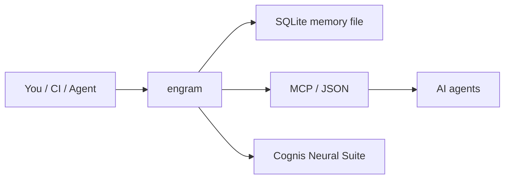

# engram

**Durable, model-agnostic long-term memory for AI agents.**

`engram` gives any AI agent — regardless of which LLM or runtime drives it — a durable
place to *remember* facts, observations, and decisions, and to *recall* the most
relevant ones later. It is deliberately small, dependency-free (Python standard library
only), and embeddable: a single SQLite file holds everything, and recall uses a
self-contained TF-IDF + cosine-similarity ranker, so there is no embedding API to call,
no vector database to run, and no network access required.

```
remember(text)  ->  persisted memory with metadata
recall(query)   ->  ranked list of the most relevant memories
```


<!-- cognis:example:start -->
## 🔎 Example output

Real, reproducible output from the tool — runs offline:

```console
$ engram-emit --version
engram 0.1.0
```

```console
$ engram-emit --help
usage: engram [-h] [--version] [--db DB] [--json]
              {remember,recall,list,get,forget,stats} ...

Durable, model-agnostic long-term memory for AI agents.

positional arguments:
  {remember,recall,list,get,forget,stats}
    remember            Store a new memory.
    recall              Retrieve relevant memories.
    list                List stored memories.
    get                 Fetch a single memory by id.
    forget              Delete a memory by id.
    stats               Show store statistics.

options:
  -h, --help            show this help message and exit
  --version             show program's version number and exit
  --db DB               Path to the SQLite memory file (default:
                        'engram_memory.sqlite').
  --json                Emit machine-readable JSON instead of human text.
```

```console
$ engram-emit stats
path                     engram_memory.sqlite
memories                 0
vocabulary_terms         0
oldest_created_at        None
newest_created_at        None
recency_halflife_days    30.0
recency_weight           0.15
schema_version           1
```

> Blocks above are real `engram` output — reproduce them from a clone.

<!-- cognis:example:end -->

## Usage — step by step

1. Install the CLI (console-scripts: `engram` and `engram-mcp`):
   ```bash
   pipx install "git+https://github.com/cognis-digital/engram.git"
   engram --version
   ```
2. Store a memory, optionally with tags, source provenance, and JSON metadata:
   ```bash
   engram remember "User prefers dark mode" --tags ui,prefs --source onboarding
   ```
3. Recall the most relevant memories for a query (filter by tag, cap results):
   ```bash
   engram recall "what UI settings does the user like?" --limit 5 --tag prefs
   ```
4. Inspect and manage the store — list, fetch by id, view stats, and delete:
   ```bash
   engram list --limit 50
   engram get 1
   engram stats
   engram forget 1
   ```
5. Give an agent durable memory over MCP by running the bundled server:
   ```bash
   engram-mcp
   ```

## Why engram

Most agent "memory" implementations are bolted to a particular model provider, a hosted
embedding endpoint, or a heavyweight vector store. That couples your agent's long-term
memory to infrastructure you may not want and to a vendor you may not keep. `engram`
takes the opposite stance:

- **Model-agnostic.** No LLM is required to store or retrieve. Wire it behind any model,
  a local fleet, or a rules engine — engram does not care which brain is driving.
- **Portable.** The entire memory is one `.sqlite` file you can copy, version, diff, or
  ship between machines. Move it from a laptop to a server and your agent keeps its mind.
- **Stdlib-only.** `sqlite3`, `math`, `re`, `json`, `argparse`. Nothing to `pip install`
  beyond Python itself. Installs and runs anywhere Python runs.
- **Inspectable.** Memories are plain rows. The ranking is plain, auditable math. You can
  read, audit, and reason about exactly why a memory was recalled.
- **MCP-native.** Ships a Model Context Protocol server so MCP-aware clients get
  `remember` / `recall` / `forget` / `list_memories` tools out of the box.

## Install

```bash
pip install -e .
# or, since it is stdlib-only, just run it in place:
python -m engram --help
```

Requires Python 3.9+.

## Quick start (Python)

```python
from engram import MemoryStore

mem = MemoryStore("agent_memory.sqlite")

mem.remember(
    "The user prefers metric units and concise answers.",
    tags=["preference", "units"],
    source="onboarding",
)
mem.remember("Deployed the trading bot to paper mode on 2026-06-08.", tags=["ops"])

for hit in mem.recall("what units does the user want", limit=3):
    print(f"{hit.score:.3f}  {hit.memory.text}")

mem.close()
```

## Quick start (CLI)

```bash
# store a memory
python -m engram remember "User's favorite ticker is GEV" --tags watchlist,equities

# retrieve relevant memories
python -m engram recall "which stock does the user like" --limit 5

# list / inspect / forget
python -m engram list --limit 20
python -m engram get 3
python -m engram forget 3
python -m engram stats
```

The database path defaults to `$ENGRAM_DB` or `./engram_memory.sqlite`. Override with
`--db /path/to/file.sqlite`. Add `--json` for machine-readable output.

## Demo

A runnable end-to-end scenario lives in `demos/01-basic/`:

```bash
python demos/01-basic/run.py
```

It seeds a memory from `seed_memories.jsonl`, runs a handful of natural-language queries,
and prints the ranked hits with scores. See `demos/01-basic/SCENARIO.md` for details.

## MCP server

`engram` ships an [MCP](https://modelcontextprotocol.io) server over stdio that exposes
the memory to any MCP-aware client (Claude Code, IDE agents, etc.) using the standard
JSON-RPC framing. It exposes four tools: `remember`, `recall`, `forget`, and
`list_memories`.

```bash
python -m engram.mcp_server --db agent_memory.sqlite
```

Example client config (e.g. an MCP `mcpServers` block):

```json
{
  "mcpServers": {
    "engram": {
      "command": "python",
      "args": ["-m", "engram.mcp_server", "--db", "/data/agent_memory.sqlite"]
    }
  }
}
```

## How recall works

1. Every stored memory is tokenized (lowercased, alphanumeric word splitting, optional
   stopword removal).
2. Document frequencies are maintained so that TF-IDF weights can be computed.
3. At query time the query is tokenized the same way, a TF-IDF vector is built for it,
   and memories are ranked by cosine similarity against that vector.
4. Recency acts as a gentle, configurable booster, so all else equal a more recent
   memory ranks slightly higher — useful for agents whose world changes over time.

This is intentionally lexical: fast, explainable, and needs no model. If you later want
semantic recall, the `MemoryStore` API is the same shape you would wrap around an
embedding backend.

## Layout

```
engram/
  __init__.py      public API surface (MemoryStore, Memory, RecallHit) + tool identity
  __main__.py      `python -m engram` entry point
  memory.py        SQLite-backed store + TF-IDF / cosine recall
  cli.py           argparse command-line interface (--version, --json, subcommands)
  mcp_server.py    stdio JSON-RPC MCP server exposing remember/recall/forget/list
pyproject.toml     packaging (name: engram)
demos/01-basic/    runnable seed-and-recall scenario
tests/             stdlib unittest suite (also runs under pytest)
```

## Testing

```bash
python -m pytest -q
# or, with no third-party deps:
python -m unittest discover -s tests -q
```

## How it fits



**Explore the suite →** [🗂️ all tools](https://github.com/cognis-digital/cognis-neural-suite) · [⭐ awesome-cognis](https://github.com/cognis-digital/awesome-cognis) · [🔗 cognis-sources](https://github.com/cognis-digital/cognis-sources)

## Interoperability

`engram` composes with the 300+ tool Cognis suite — JSON in/out and a shared
OpenAI-compatible `/v1` backbone. See **[INTEROP.md](INTEROP.md)** for the
suite map, composition patterns, and reference stacks.

## Integrations

Forward `engram`'s findings to STIX/MISP/Sigma/Splunk/Elastic/Slack/webhooks via
[`cognis-connect`](https://github.com/cognis-digital/cognis-connect). See **[INTEGRATIONS.md](INTEGRATIONS.md)**.

## License

Source-available under the **Cognis Open Collaboration License (COCL) v1.0**. See
`LICENSE`. Commercial use requires a separate license — contact
`licensing@cognis.digital`.

---

Built by **Cognis Digital LLC**. Part of the Cognis Neural Suite.
